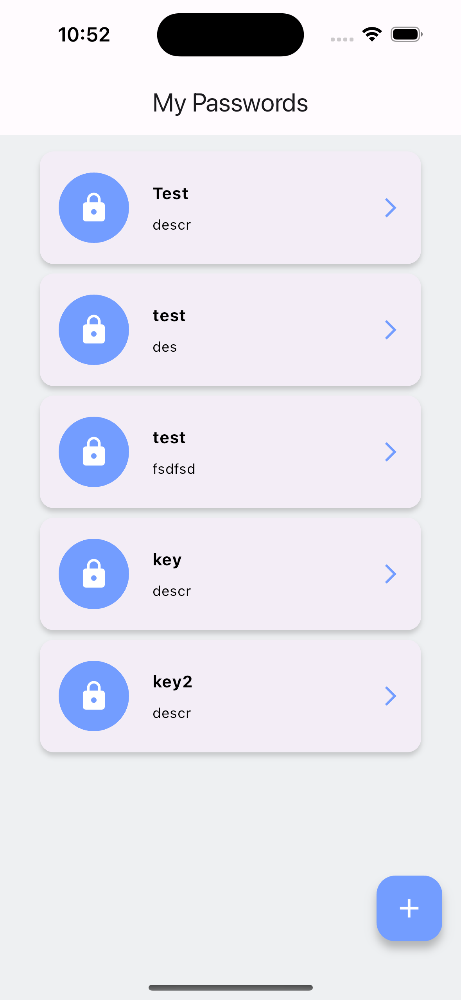
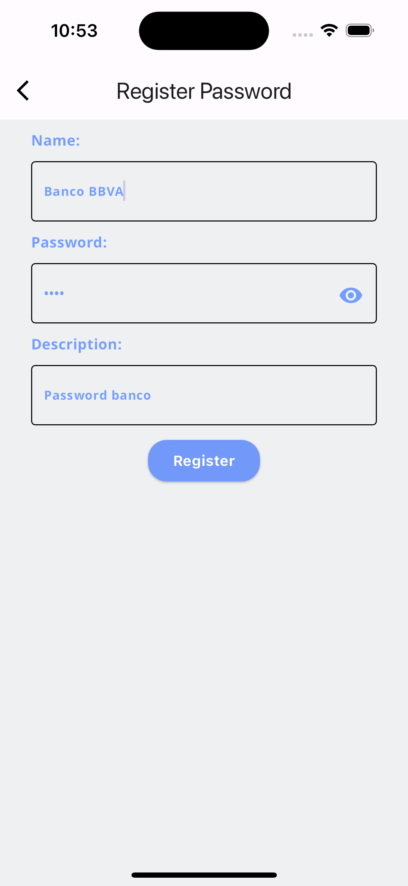
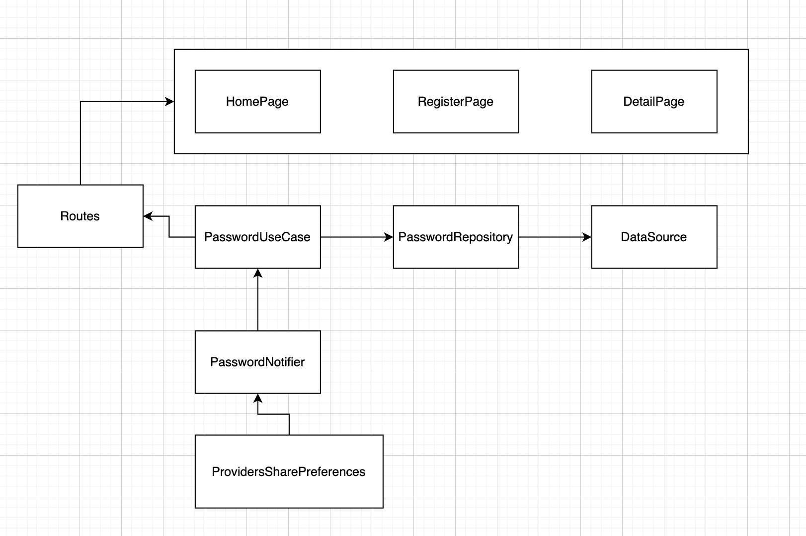

# Fase 1 App

Proyecto que busca resolver la fase 1 de la ruta de crecimiento practica en flutter.


## Download

Download phase_one project

```bash
  git clone git@github.com:felipepragma/phase_one.git
```

## Installation

Instalation flutter project

```bash
  flutter pub get
  flutter run
```
    
## Screenshots App







## Arch

**Dependency Inject:** Riverpod

**Routes:** GoRoute

