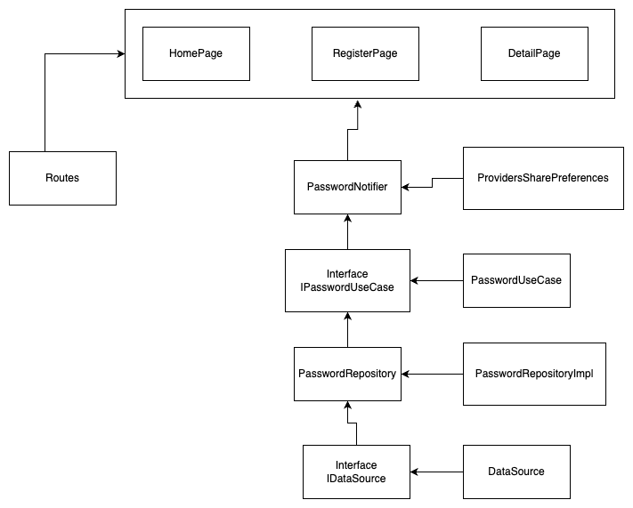

# Phase 1 App

Project that solves phase 1 of the practical growth path in flutter.


## Download

Download phase_one project

```bash
  git clone git@github.com:felipepragma/phase_one.git
```

## Installation

Instalation flutter project

```bash
  flutter pub get
  flutter run
```

## Arch

It was used in the **clean architecture** project based on **features**

**Dependency Inject:** Riverpod

**Routes:** GoRoute

